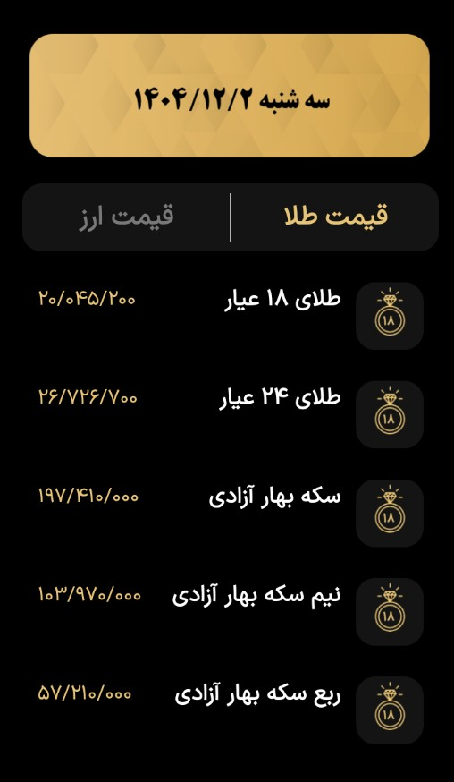
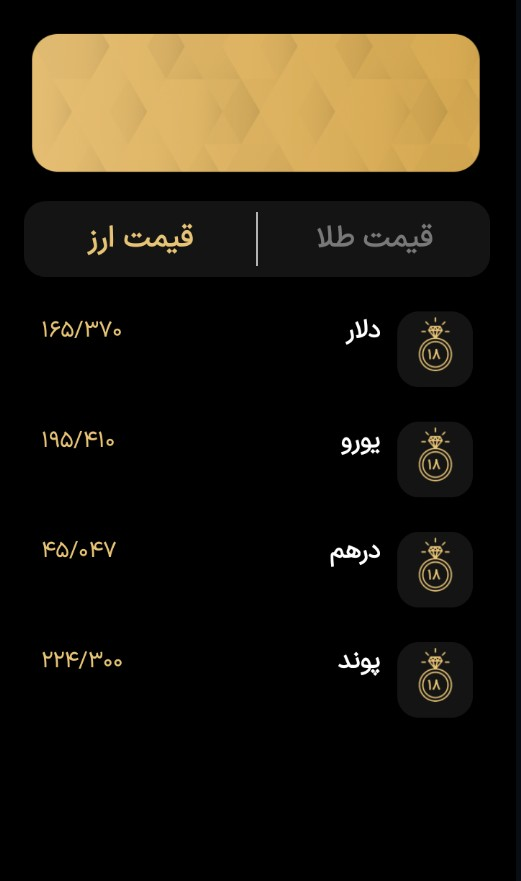
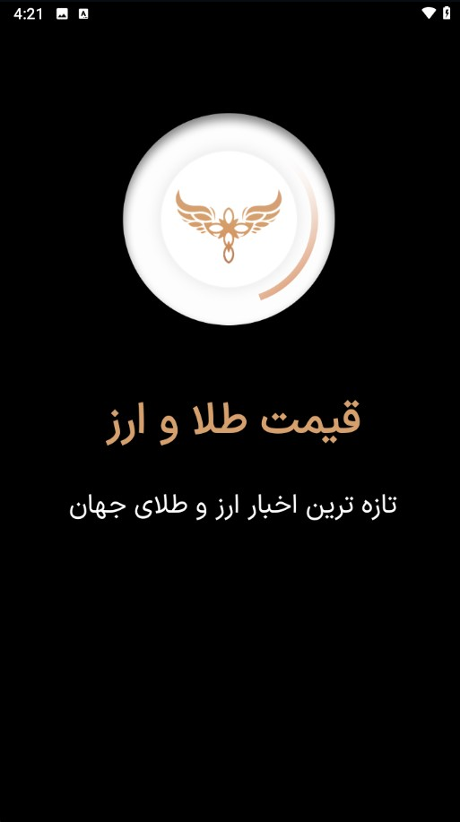

# اپلیکیشن نمایش انلاین قیمت ارز و طلا 

یک اپلیکیشن اموزشی ساده برای نمایش بروز قیمت ارز و طلا که با **Kotlin** و    layoutهای XML نوشته شده.  

<table style="width:100%">
  <tr>
    <td></td> 
    <td></td> 
    <td></td> 
  </tr>

## تکنولوژی‌های استفاده شده
- زبان: **Kotlin**

RecyclerView - constraintlayout -  Retrofit

- محیط توسعه: **Android Studio**
- minSdk = 24
  targetSdk = 34
  

#)
